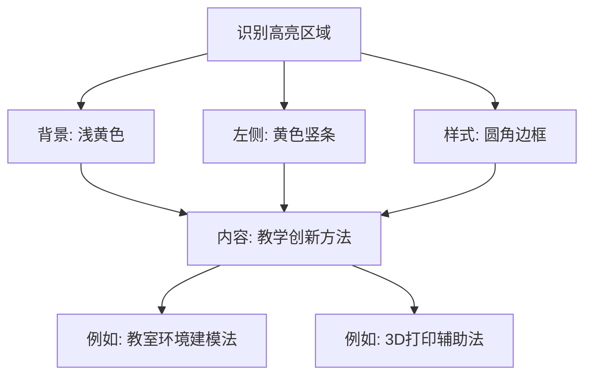

# 使用与阅读指南

<cite>
**Referenced Files in This Document**   
- [index.html](file://index.html)
</cite>

## 目录
1. [面向教育工作者和研究人员的使用建议](#面向教育工作者和研究人员的使用建议)
2. [面向学生和初学者的阅读路径](#面向学生和初学者的阅读路径)
3. [移动设备阅读与响应式布局](#移动设备阅读与响应式布局)
4. [关键教学创新点识别](#关键教学创新点识别)
5. [文档使用与显示说明](#文档使用与显示说明)

## 面向教育工作者和研究人员的使用建议

对于教育工作者和研究人员，本文档提供了系统化的教学策略与实证数据支持。您可以通过文档中的**目录（ToC）** 快速跳转至感兴趣的章节，实现高效查阅。

- **教学策略**：建议重点阅读“二、'三维递进'教学策略的理论基础”和“三、'三维递进'教学策略的实践探索”部分，了解该策略的理论依据和具体实施方法。
- **实验数据**：如需查看教学效果的量化分析，请直接跳转至“四、教学效果与数据分析”部分，该章节提供了前测后测对比、问卷调查结果等详细数据。
- **改进建议**：在“五、教学反思与改进建议”中，总结了教学实践中的成功经验、存在的问题以及具体的改进建议，为教学优化提供参考。

特别建议重点关注“三、'三维递进'教学策略的实践探索”与“四、教学效果与数据分析”部分。前者详细阐述了“投影基础认知”、“投影体系构建”和“投影规律应用”三个维度的具体教学方法，后者通过真实数据验证了教学策略的有效性，两者结合可为其他教师提供可复制、可推广的教学范式。

**Section sources**
- [index.html](file://index.html#L150-L300)
- [index.html](file://index.html#L301-L340)

## 面向学生和初学者的阅读路径

对于学生或初学者，建议遵循以下渐进式阅读路径，以系统性地理解三视图教学的核心内容：

1.  **阅读摘要**：首先阅读“摘要”部分，快速了解本研究的核心内容、提出的教学策略及其主要成效，形成整体印象。
2.  **理解学习难点**：接着阅读“一、问题提出”部分，明确学生在学习三视图时普遍存在的困难，如空间想象能力不足、投影规律理解困难等，这有助于您对照自身学习中的问题。
3.  **按“三维递进”顺序学习**：这是学习的核心路径，应按顺序逐步深入：
    -   **第一维度：投影基础认知**：从最基础的投影概念入手，建立初步的空间感知。
    -   **第二维度：投影体系构建**：学习如何在三维空间中建立坐标系，理解三个投影面（主视图、俯视图、左视图）之间的关系。
    -   **第三维度：投影规律应用**：掌握“长对正、宽相等、高平齐”等核心投影规律，并学习其在实际问题中的应用。
4.  **把握整体价值**：最后阅读“六、结论与展望”部分，了解该教学策略的整体价值、未来发展方向以及对教育本质的思考，从而把握研究的深远意义。

此路径遵循了从问题到解决方案，再到效果验证和未来展望的逻辑，符合认知规律，有助于初学者构建完整的知识体系。

**Section sources**
- [index.html](file://index.html#L100-L150)
- [index.html](file://index.html#L150-L300)
- [index.html](file://index.html#L341-L347)

## 移动设备阅读与响应式布局

本文档采用了响应式网页设计，能够完美适配手机、平板等移动设备。当您在小屏幕上阅读时，页面会自动调整布局：
- 字体大小和行间距会进行优化，确保在小屏幕上依然清晰可读。
- 容器宽度会自适应屏幕，边距减小，充分利用屏幕空间。
- 标题和段落的样式会进行相应调整，保持良好的视觉层次。

您无需任何特殊操作，只需在移动设备的浏览器中打开文档，即可获得流畅的阅读体验。文档通过 `<meta name="viewport" content="width=device-width, initial-scale=1.0">` 这一设置，确保了页面能够根据设备的屏幕宽度进行缩放和适配。

**Section sources**
- [index.html](file://index.html#L4)
- [index.html](file://index.html#L120-L125)

## 关键教学创新点识别

文档中使用了**高亮区域**来突出显示重要的教学创新方法和核心概念，便于读者快速识别和关注。这些高亮区域具有统一的视觉特征：背景色为浅黄色（`#fff3cd`），左侧有黄色竖条，并带有圆角边框。

例如：
- “**教室环境建模法**”：这是一种创新的教学方法，将整个教室视为一个三维坐标系，让学生在真实环境中进行空间点定位练习，极大地增强了学习的直观性和参与感。
- “**3D打印辅助法**”：通过设计和使用3D打印模型来直观展示投影的“真实性、收缩性、积聚性”三大特征，将抽象概念具象化。

识别这些高亮区域是快速掌握文档核心创新点的关键。

**Diagram sources**
- [index.html](file://index.html#L110-L115)
- [index.html](file://index.html#L220-L225)
- [index.html](file://index.html#L250-L255)

## 文档使用与显示说明

本文档为一个独立的静态网页（`index.html`），使用极其简便：
- **无需安装或配置**：文档不依赖任何外部服务器或数据库，所有内容均已包含在单个HTML文件中。
- **打开方式**：只需在您的电脑上**双击 `index.html` 文件**，即可在默认的网页浏览器（如Chrome、Edge、Firefox等）中打开并阅读。
- **适用场景**：既适用于个人本地查阅，也方便分享。您可以将此文件通过邮件发送、上传至网盘，或部署为静态网页（如GitHub Pages）进行在线分享。

**显示效果提醒**：为了获得最佳的中文显示效果，建议确保您的本地系统已安装或支持 **'Microsoft YaHei'（微软雅黑）** 和 **'SimSun'（宋体）** 这两种中文字体。文档的CSS样式中已指定优先使用这两种字体，它们能提供清晰、美观的中文阅读体验。

**Section sources**
- [index.html](file://index.html#L8)
- [index.html](file://index.html#L10)