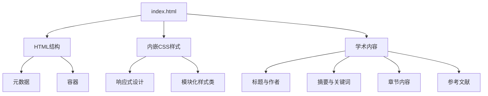
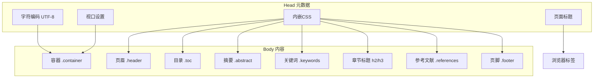
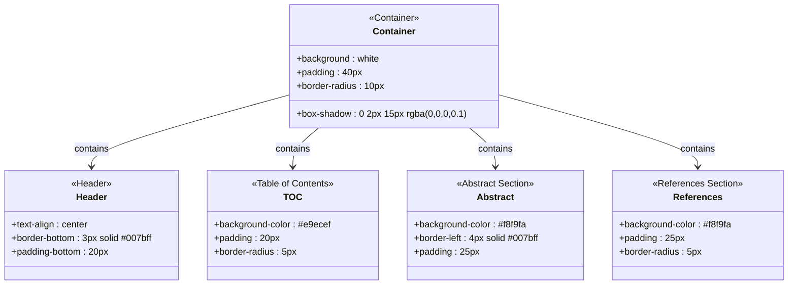
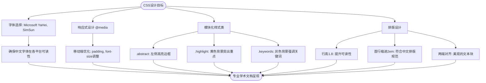
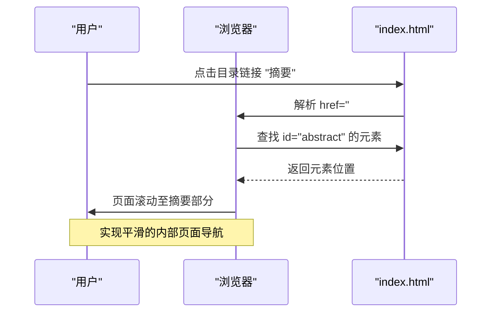
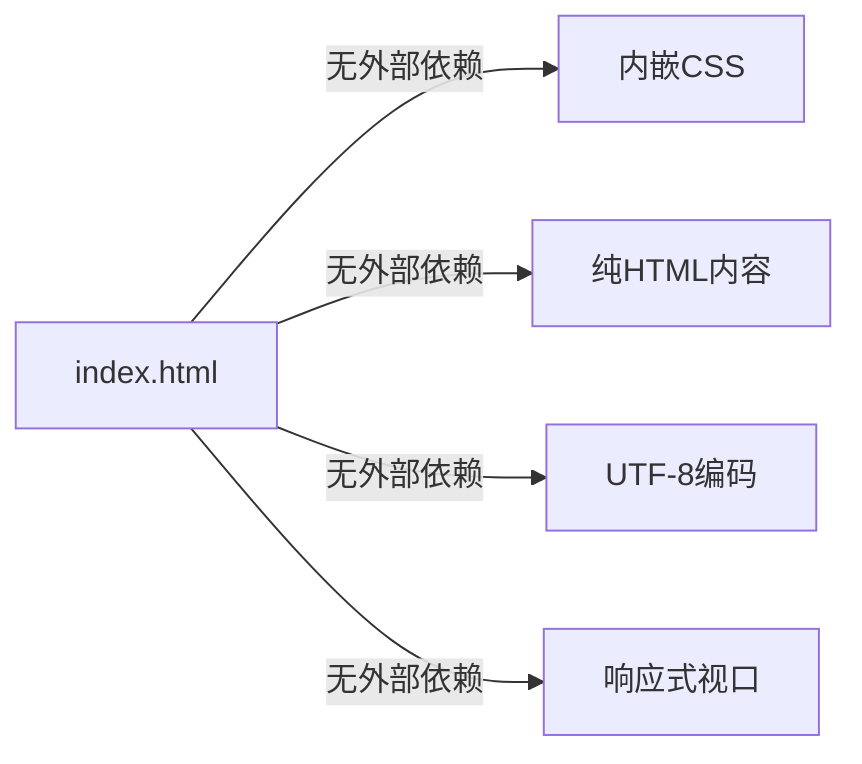

# 文件结构说明

<cite>
**Referenced Files in This Document**   
- [index.html](file://index.html)
</cite>

## 目录
1. [引言](#引言)
2. [项目结构](#项目结构)
3. [核心组件](#核心组件)
4. [架构概述](#架构概述)
5. [详细组件分析](#详细组件分析)
6. [依赖分析](#依赖分析)
7. [性能考虑](#性能考虑)
8. [故障排除指南](#故障排除指南)
9. [结论](#结论)
10. [附录](#附录)（如需要）

## 引言
本文档旨在详细解析`index.html`文件的内部结构及其在学术论文项目中的独特作用。该文件采用单文件架构，完整集成了学术论文的所有内容模块与样式定义，包括标题、作者、摘要、关键词、各级章节、参考文献和页脚等。通过分析其HTML结构与内嵌CSS设计，揭示该文件如何实现内容组织、视觉呈现和交互导航功能，为用户提供复用和修改此模板的指导建议。

## 项目结构
本项目采用极简的单文件架构，仅包含一个核心HTML文件。这种设计使得整个学术论文内容、样式和结构完全封装于单一文件中，极大简化了部署和分享流程。

**Diagram sources**
- [index.html](file://index.html#L1-L347)

**Section sources**
- [index.html](file://index.html#L1-L347)

## 核心组件
`index.html`文件的核心在于其将学术论文的所有必要元素整合于一个文件中。通过语义化的HTML结构和模块化的CSS类，实现了内容与样式的紧密结合。文件通过`
`容器的层级划分，构建了清晰的内容组织结构，包括页眉、目录、摘要、正文章节、参考文献和页脚等关键部分，确保了学术论文的专业呈现。

**Section sources**
- [index.html](file://index.html#L1-L347)

## 架构概述
该文件采用单页应用（SPA）式的静态架构，所有内容和样式均内置于一个HTML文件中。这种架构避免了外部资源依赖，确保了文件的独立性和可移植性。通过内嵌`<style>`标签定义完整的CSS样式表，实现了样式与内容的紧密耦合，同时利用语义化的类名（如`.abstract`、`.references`）实现了模块化的样式管理。

**Diagram sources**
- [index.html](file://index.html#L1-L347)

## 详细组件分析

### HTML结构与语义划分
`index.html`文件通过精心设计的`
`容器实现了内容的语义化划分。`.container`作为最外层容器，提供了页面的主体框架和阴影效果；`.header`容器集中管理标题和作者信息，通过居中对齐和底部边框突出显示；`.toc`（目录）容器不仅提供导航入口，其浅灰色背景也起到了视觉分隔的作用。

#### 主要容器功能分析：

**Diagram sources**
- [index.html](file://index.html#L50-L100)

**Section sources**
- [index.html](file://index.html#L150-L185)

### 元数据与样式设计
`<head>`部分的元数据配置体现了现代Web标准的最佳实践。`<meta charset="UTF-8">`确保了中文字符的正确显示；`<meta name="viewport">`配置实现了响应式设计，保证了在移动设备上的良好浏览体验；页面标题准确反映了论文主题。

#### 内嵌CSS设计意图分析：

**Diagram sources**
- [index.html](file://index.html#L10-L140)

**Section sources**
- [index.html](file://index.html#L10-L140)

### 导航机制与交互设计
文件通过HTML锚点实现了内部导航功能。目录中的链接（如`<a href='#abstract'>`）与对应内容区域的ID（如`id='abstract'`）形成精确匹配，点击目录项即可跳转到相应章节。这种设计提升了长文档的可用性，使读者能够快速定位感兴趣的内容。

**Diagram sources**
- [index.html](file://index.html#L177-L188)

**Section sources**
- [index.html](file://index.html#L177-L188)

## 依赖分析
本项目采用零依赖的架构设计，不依赖任何外部CSS框架、JavaScript库或图片资源。所有样式均通过内嵌`<style>`标签定义，所有内容均直接写入HTML文件。这种设计确保了文件的完全自包含性，但也意味着所有修改都必须直接在该文件内进行。

**Diagram sources**
- [index.html](file://index.html#L1-L347)

**Section sources**
- [index.html](file://index.html#L1-L347)

## 性能考虑
由于采用单文件架构，该实现具有极佳的性能特性。页面加载仅需一次HTTP请求，无需额外加载CSS或JS文件，实现了最快的加载速度。内嵌样式避免了渲染阻塞问题，确保了内容的快速呈现。响应式设计通过媒体查询优化了移动端的显示效果，提升了跨设备的用户体验。

## 故障排除指南
当使用此模板时，可能遇到的常见问题及解决方案：
- **中文显示乱码**：确保文件保存为UTF-8编码格式，检查`<meta charset="UTF-8">`是否存在。
- **移动端显示异常**：验证`<meta name="viewport">`标签的正确性，确保内容能适应小屏幕。
- **样式不生效**：检查CSS类名是否拼写正确，确认HTML元素正确应用了相应的类。
- **导航跳转失效**：确保`<a href="#id">`中的ID与目标元素的`id="id"`完全匹配，包括大小写和特殊字符。

**Section sources**
- [index.html](file://index.html#L3-L4)

## 结论
`index.html`文件通过精巧的单文件设计，成功实现了学术论文的完整呈现。其优势在于轻量、易部署、自包含，特别适合快速分享和展示。然而，这种架构也存在不可扩展、难以维护的局限性，不适合内容频繁更新或需要团队协作的场景。对于希望复用此模板的用户，建议根据需要修改标题、作者信息，并可通过调整CSS中的颜色变量（如`#007bff`蓝色系）和字体设置来个性化文档外观。

## 附录
### 修改建议
为便于用户复用此模板，提供以下修改建议：
1. **更换标题与作者**：修改`<h1>`标签内的文本和`.author`类中的作者信息。
2. **调整主题颜色**：在CSS中搜索`#007bff`并替换为所需颜色，可统一改变标题、链接和边框的色调。
3. **修改字体**：在`body`的`font-family`属性中调整中文字体优先级，或添加新的字体选项。
4. **增删章节**：复制现有`<h2>`章节结构，修改ID和标题文本，并在目录中添加相应链接。
5. **更新参考文献**：在`.references`容器内修改`<ol>`列表中的文献条目。