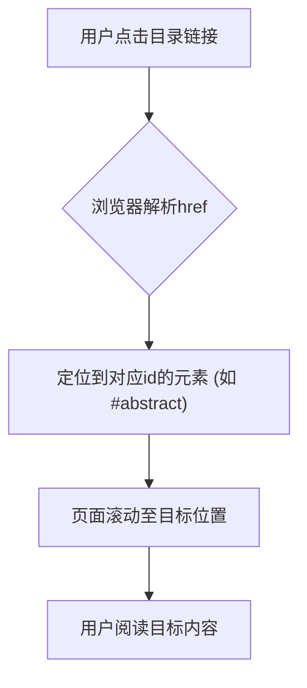

# 项目概述

<cite>
**Referenced Files in This Document**   
- [index.html](file://index.html)
</cite>

## 目录
1. [引言](#引言)
2. [论文结构与逻辑关系](#论文结构与逻辑关系)
3. "三维递进"教学策略的理论基础
4. 教学实践探索与创新方法
5. 教学效果与数据分析
6. 反思与改进建议
7. 结论与未来展望
8. 文档技术实现与交互设计
9. 阅读指南

## 引言

本学术研究报告聚焦于通用技术课程中的核心难点——三视图教学，提出并验证了一种创新的“三维递进”教学策略。该研究旨在解决学生在学习三视图时普遍存在的空间想象能力不足、投影规律理解困难等问题。通过系统化的教学设计，研究探索了如何有效培养学生的空间认知能力，为通用技术教育提供了可复制、可推广的实践范例。报告不仅阐述了教学策略的理论依据和实施过程，还通过严谨的实验数据验证了其教学效果，具有重要的理论价值和实践意义。

## 论文结构与逻辑关系

本研究报告采用严谨的学术论文结构，各部分之间逻辑清晰、层层递进。报告以“问题提出”为起点，明确研究的现实背景和核心挑战；继而阐述“三维递进”教学策略的“理论基础”，为实践探索提供坚实的学理支撑；随后详细描述“实践探索”过程，展示教学策略的具体实施路径；通过“效果分析”部分，用数据客观评估教学策略的有效性；在“反思建议”中，总结经验并提出改进方向；最后以“结论展望”收束全文，提炼研究成果并指明未来发展方向。这种“问题-理论-实践-验证-反思-结论”的逻辑链条，确保了研究的完整性和科学性。

**Section sources**
- [index.html](file://index.html#L181-L197)

## "三维递进"教学策略的理论基础

“三维递进”教学策略的构建根植于三大教育理论：
1.  **建构主义学习理论**：强调学生是知识的主动建构者。教学从学生的生活经验出发（如影子现象），通过具体活动帮助其在头脑中构建抽象的空间概念。
2.  **认知负荷理论**：认识到三视图学习的认知复杂度。策略通过分阶段教学（从基础认知到体系构建再到规律应用），将复杂任务分解，有效降低了学生的外在认知负荷，使其能将认知资源集中于核心概念的理解。
3.  **多元智能理论**：尊重学生的个体差异。教学采用生活实例、实物演示、多媒体动画、3D打印模型等多种手段，满足不同智能类型学生的学习需求，确保教学的普适性和有效性。

**Section sources**
- [index.html](file://index.html#L209-L222)

## 教学实践探索与创新方法

“三维递进”策略的实践探索分为三个递进的维度：
1.  **第一维度：投影基础认知**：通过生活实例（阳光下的影子）和实物演示（手电筒照射物体），帮助学生建立投影的基本概念。
2.  **第二维度：投影体系构建**：这是教学的核心与难点。创新性地采用“**教室环境建模法**”，将整个教室视为一个三维坐标系。以黑板墙、地板和侧墙分别作为主视图、俯视图和左视图的投影面，让学生在真实空间中进行测量和定位，从而深刻理解三个投影面的空间关系和维度特性。
3.  **第三维度：投影规律应用**：利用具体数据（如“向右4米、向前3米、向上5米”）引导学生总结“长对正、宽相等、高平齐”的“三等关系”。同时，采用“**3D打印辅助法**”，通过特制的模型直观展示投影的“真实性、收缩性、积聚性”三大特征。

**Section sources**
- [index.html](file://index.html#L222-L263)

## 教学效果与数据分析

研究通过对比实验（实验班采用新策略，对照班采用传统方法）对教学效果进行了量化分析。数据表明，“三维递进”教学策略成效显著：
-   **空间概念建立**：实验班85%以上的学生能准确理解空间点的坐标关系，比对照班高出35个百分点。
-   **投影规律掌握**：实验班对“三等关系”的应用正确率达88%，显著高于对照班的62%。
-   **学习兴趣与能力提升**：92%的学生认为新方法生动有趣，学习积极性提高；实验班学生的空间想象能力平均提升了40%。
-   **思维路径形成**：学生能够遵循“先找方向，再找数据”的系统性思维路径解决问题，逻辑推理能力增强。

**Section sources**
- [index.html](file://index.html#L264-L298)

## 反思与改进建议

研究总结了成功经验，如生活化情境创设、循序渐进的设计和多元化教学手段的应用。同时也反思了存在的不足，包括对个别学生的辅导不足、教学时间较长以及评价体系不够全面。基于此，提出了改进建议：实施分层教学以满足不同学生的需求；开发数字化教学资源（如交互式课件）支持自主学习；完善包含过程性评价的多元评价体系；并加强教师间的教研交流以促进专业发展。

**Section sources**
- [index.html](file://index.html#L299-L315)

## 结论与未来展望

“三维递进”教学策略通过三个维度的层层递进，有效解决了三视图教学的难点，显著提升了学生的空间认知能力和工程素养。该策略为通用技术课程的有效实施提供了宝贵的实践参考。未来，研究将探索将虚拟现实（VR）和增强现实（AR）等新技术融入教学，创造更沉浸式的学习体验，并致力于加强跨学科融合，为培养具有创新精神和实践能力的高素质人才做出贡献。

**Section sources**
- [index.html](file://index.html#L316-L326)

## 文档技术实现与交互设计

本HTML文档通过语义化标签和CSS样式实现了内容的结构化与可视化呈现。
-   **结构化**：使用`
`、`
`、`
`等语义化类名组织内容，使文档结构清晰。
-   **可视化**：通过CSS定义了统一的字体、颜色、间距和背景色，如`.highlight`类用于突出显示创新教学方法，`.keywords`类用于区分关键词，提升了可读性。
-   **响应式设计**：通过`@media (max-width: 768px)`查询，实现了移动端适配，确保在不同设备上均有良好的阅读体验。
-   **交互式目录导航**：利用HTML锚点链接（`<a href="#section-id">`）实现了目录的跳转功能。点击目录中的条目（如“摘要”、“问题提出”），页面会平滑滚动至对应章节，极大地方便了用户快速定位内容。

**Diagram sources**
- [index.html](file://index.html#L141-L181)
- [index.html](file://index.html#L181-L197)

**Section sources**
- [index.html](file://index.html#L141-L181)

## 阅读指南

### 初学者指南
-   **三视图**：指主视图、俯视图和左视图，是将三维物体从三个互相垂直的方向投影到平面上得到的二维图形。
-   **投影体系构建**：指建立一个由三个互相垂直的投影面（正立、水平、侧立）组成的坐标系，理解物体在其中的投影规律。
-   **三维递进策略**：一种分三步走的教学方法：① 认知投影基础 → ② 构建投影体系 → ③ 应用投影规律。
-   **快速定位**：使用左侧的“📋 目录”，点击您感兴趣的章节标题，即可跳转到相应内容。

### 研究人员指南
-   **教学实验设计**：研究采用对照实验法，比较实验班（新策略）与对照班（传统方法）的教学效果。
-   **数据收集方法**：综合运用了前测/后测成绩、过程性评价、问卷调查等多种数据收集方式。
-   **效果评估逻辑**：通过对比两班在空间概念建立、规律掌握、能力提升等维度的量化数据，客观评估策略的有效性。

**Section sources**
- [index.html](file://index.html#L181-L197)
- [index.html](file://index.html#L264-L298)